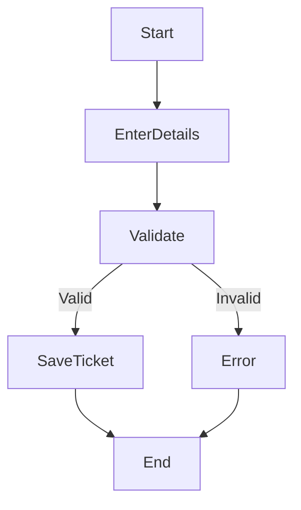
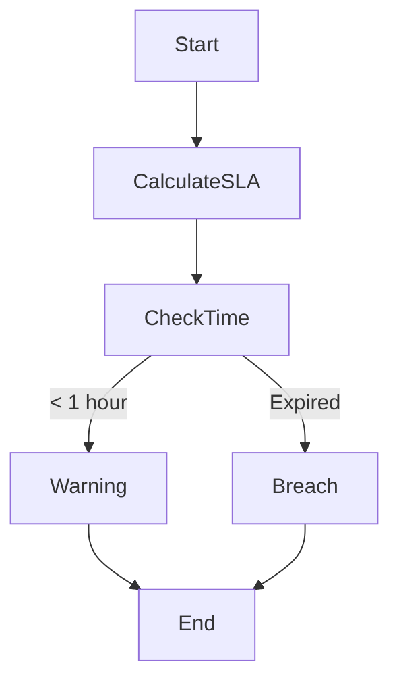
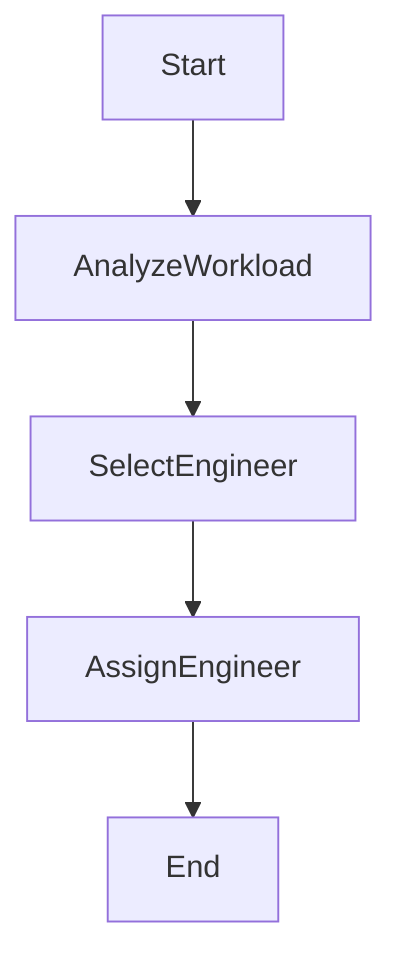
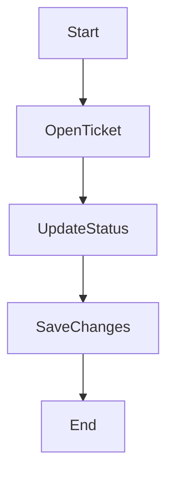
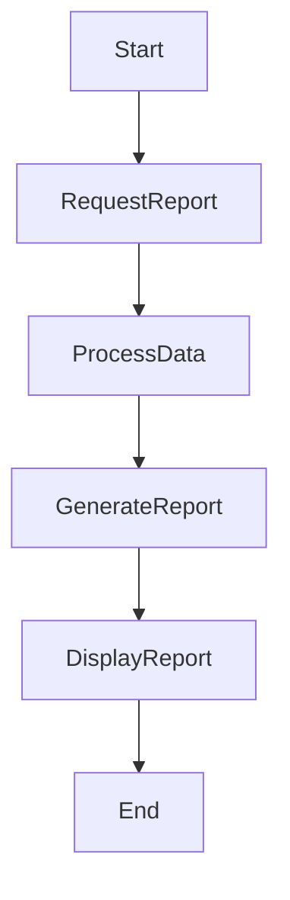
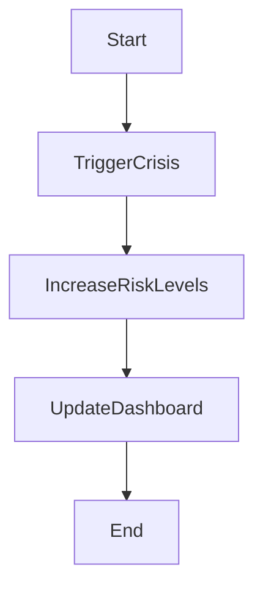
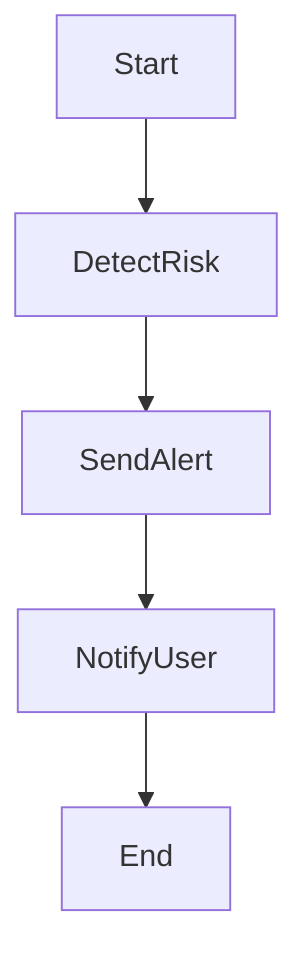
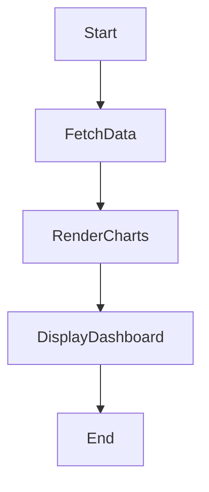

# Activity Diagrams

## 1. Log Ticket Workflow

### Explanation

This workflow shows how tickets are created and validated before saving.

Aligned with:
- FR-002
- US-002

## 2. SLA Monitoring Workflow

### Explanation

This workflow shows how SLA is continuously monitored.

It ensures early warnings before breaches.

Aligned with:
- FR-003 (SLA Monitoring)
- US-003 (Calculate SLA)

## 3. Engineer Recommendation Workflow

### Explanation

This workflow selects the most suitable engineer based on workload.

Aligned with:
- FR-004 (Dispatch)
- US-004 (Recommend Engineer)

## 4. Update Ticket Workflow

## 5. Generate Report Workflow

## 6. Crisis Simulation Workflow

## 7. Alert System Workflow

## 8. Dashboard Load Workflow

