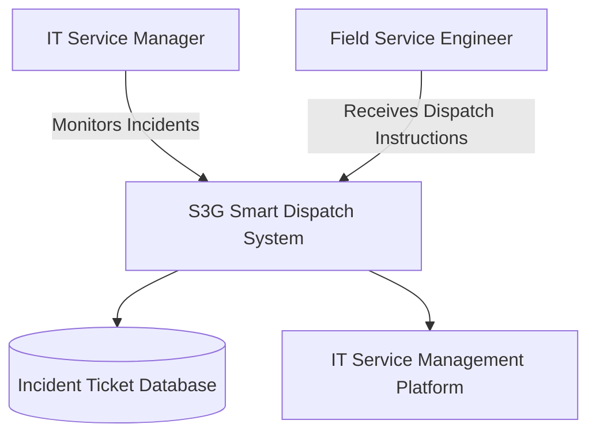
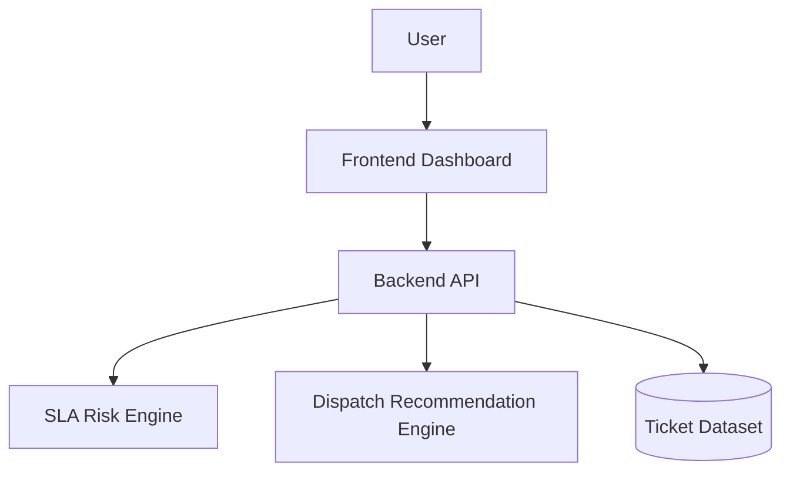
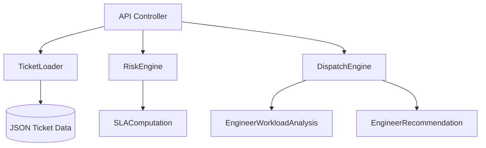

# System Architecture

## Project Title
S³G Smart Dispatch System

## Domain
Enterprise IT Service Management

## Problem Statement
Organisations require intelligent systems that can monitor incident tickets in real time and prevent SLA breaches through predictive analysis and smart dispatch recommendations.

## C4 Architecture Model

### Level 1 – System Context

Users:
- IT Service Manager
- Field Service Engineers

External Systems:
- IT Service Management Platform
- Ticket Database

System:
S³G Smart Dispatch System

Purpose:
Provide intelligent SLA monitoring and dispatch recommendations.

---

### Level 2 – Container Diagram

Containers:

Frontend Dashboard
- HTML
- CSS
- JavaScript
- Chart.js

Backend API
- Python Flask service
- SLA Risk Engine
- Dispatch Recommendation Engine

Data Storage
- JSON Ticket Dataset

---

### Level 3 – Component Diagram

Backend Components:

Ticket Loader  
Loads incident ticket data.

SLA Risk Engine  
Calculates remaining SLA time and breach probability.

Dispatch Recommendation Engine  
Selects the most suitable engineer based on workload and SLA urgency.

API Controller  
Provides endpoints for dashboard communication.

## C4 Level 1 – System Context Diagram

## C4 Level 2 – Container Diagram

## C4 Level 3 – Component Diagram

