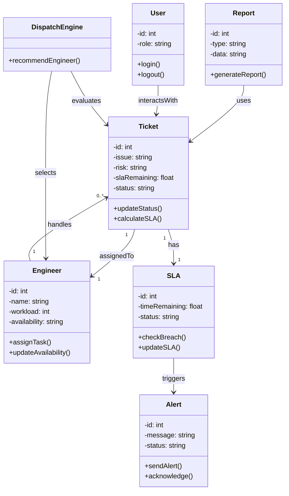

# Class Diagram – S³G Smart Dispatch System

## Explanation

The class diagram represents the core structure of the S³G Smart Dispatch System.

- Ticket is the central entity linked to SLA and Engineer.
- SLA monitors time and triggers alerts when breached.
- Engineer handles multiple tickets based on workload.
- DispatchEngine is responsible for intelligent assignment.

This design aligns with:
- Functional Requirements (Assignment 4)
- Use Cases (Assignment 5)
- State Diagrams (Assignment 8)