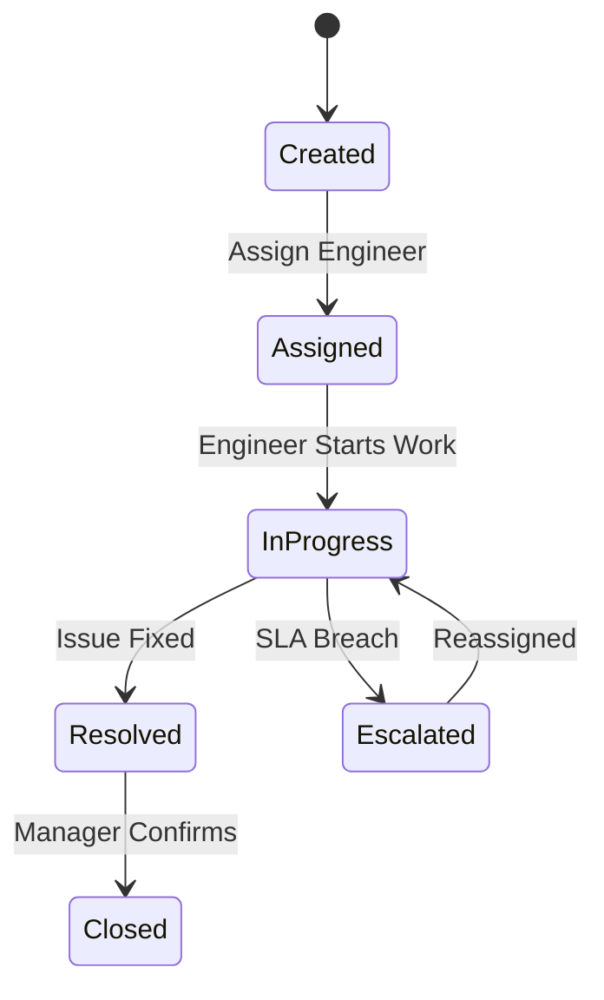
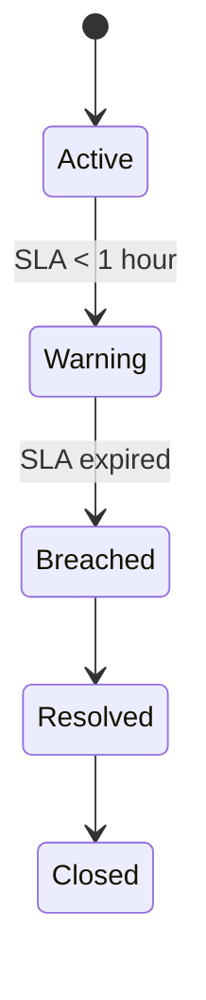
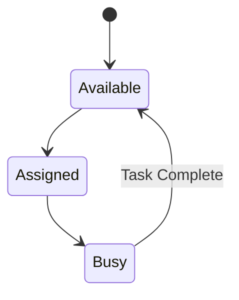
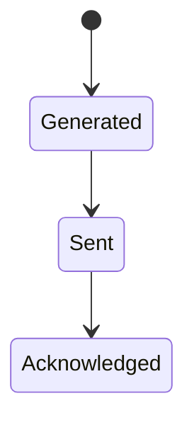
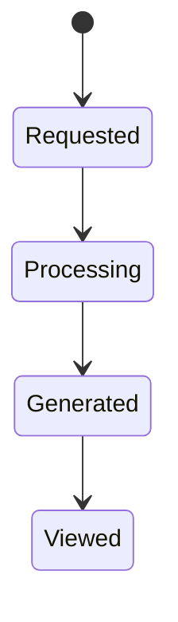
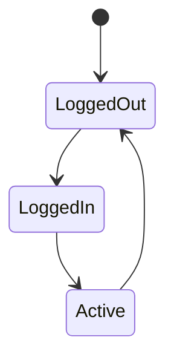
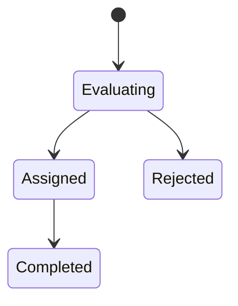

# State Transition Diagrams

## 1. Ticket Lifecycle

### Explanation

This diagram shows how a ticket moves through different states.

- Created → Assigned → In Progress → Resolved → Closed
- Escalation occurs when SLA is breached

This aligns with:
- FR-002 (Log Ticket)
- FR-003 (SLA Monitoring)
- FR-004 (Engineer Recommendation)

## 2. SLA Lifecycle

### Explanation

This diagram shows how SLA status changes from active to breached.

It aligns with:
- FR-003 (SLA Monitoring)
- US-003 (Calculate SLA)

## 3. Engineer Lifecycle

### Explanation

This diagram shows how engineers move between availability states.

It supports:
- FR-004 (Engineer Recommendation)

## 4. Alert Lifecycle

## 5. Report Lifecycle

## 6. User Session

## 7. Dispatch Decision

