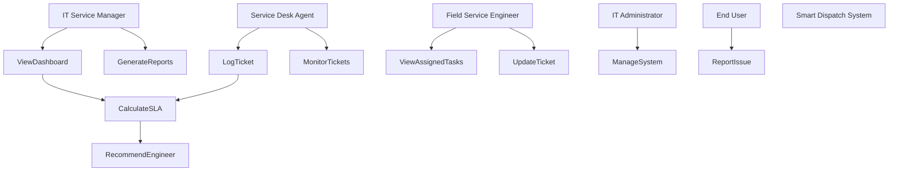

# Use Case Diagram – S³G Smart Dispatch System

## Explanation

Actors:
- IT Service Manager: Monitors dashboard and generates reports
- Field Engineer: Resolves assigned incidents
- Service Desk Agent: Logs and monitors tickets
- IT Administrator: Maintains system
- End User: Reports issues

Relationships:
- "Log Ticket" includes "Calculate SLA"
- "Calculate SLA" leads to "Recommend Engineer"

This ensures stakeholder concerns such as SLA monitoring and workload balancing are addressed.