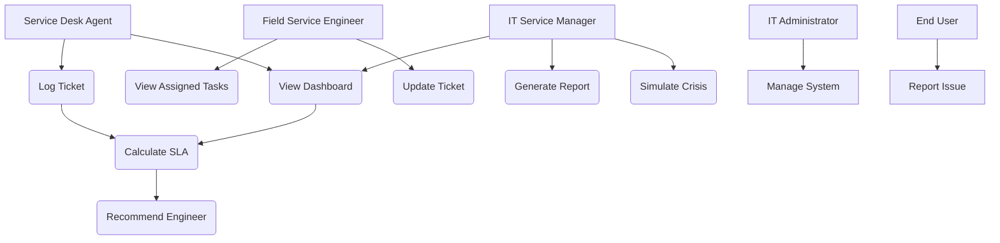

# Use Case Diagram – S³G Smart Dispatch System

## Explanation

The system consists of multiple actors interacting with core use cases.

- The **Service Desk Agent** logs tickets, which includes SLA calculation.
- The **SLA Calculation** use case triggers the **Engineer Recommendation** process.
- The **IT Service Manager** monitors the system through the dashboard and can simulate crisis scenarios.
- The **Engineer** interacts with assigned tasks and updates ticket progress.

The inclusion relationships ensure automation of SLA tracking and intelligent dispatching, directly addressing stakeholder concerns such as reducing SLA breaches and improving workload distribution.